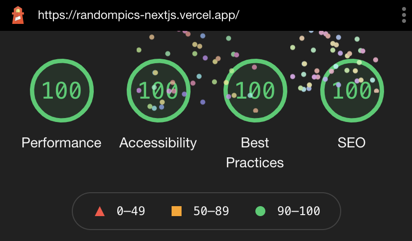

# Notes

Small project created with Next.js to learn React and the framework itself.

Shows basic usage of Hooks and CSS modules.

It is a work in progress, so no all features work perfectly nor uses all the benefits that Next.js offers.

You can check it out [here](https://randompics-nextjs.vercel.app/).

Lighthouse score simulating a mobile device:

